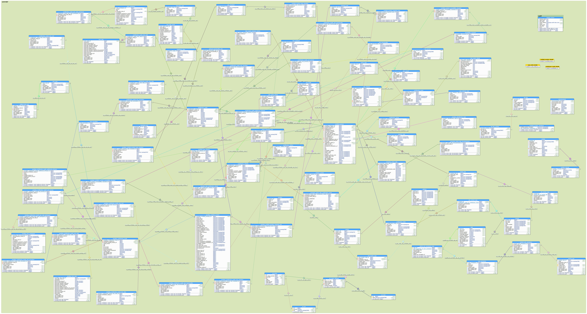
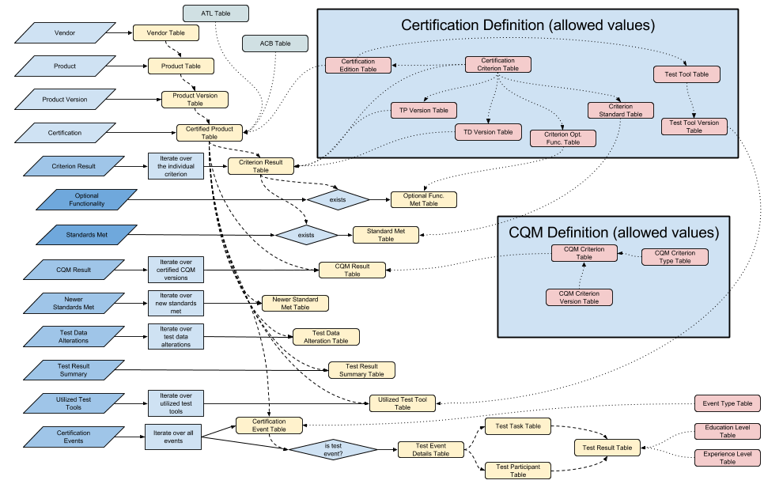

# Data Model for Open Data CHPL

This is the Data Model for the Open Data CHPL.

The data model diagram is such: 

The data flow diagram is here: 

# Installation

## Getting the code

```sh
$ git clone https://github.com/andlar/chpl-api.git
$ cd openchpl-sql
```

## Data model load

Rename `openchpl-role-template.sql` to `openchpl-role.sql` and set the password for the `openchpl` role. These instructions assume the role/username used for the openchpl database is `openchpl`, and that the password in `openchpl-role.sql`, currently recorded as "change this password" will be update to match your installation. If the installer chooses to change the username/role, make sure it's also changed in the `openchpl.sql` file wherever the role is used.

Next, run the script `reset.sh` or `reset.bat`. These two scripts run the following commands, which remove any previous OpenCHPL data model installation, with the associated roles, then recreate the required roles and databases, as well as fill out some of those database schemas with some required information.

```sh
$ psql -Upostgres -f drop-openchpl.sql openchpl
$ psql -Upostgres -f drop-openchpl.sql openchpl_test
$ psql -Upostgres -f drop-role.sql
$ psql -Upostgres -f openchpl-role.sql
$ psql -Upostgres -f create-databases.sql
$ psql -Upostgres -f openchpl.sql openchpl
$ psql -Upostgres -f openchpl.sql openchpl_test
$ psql -Upostgres -f audit-openchpl.sql openchpl
$ psql -Upostgres -f audit-openchpl.sql openchpl_test
$ psql -Upostgres -f preload-openchpl.sql openchpl
$ psql -Upostgres -f preload-openchpl.sql openchpl_test
$ psql -Upostgres -f preload-user_contact_acl.sql openchpl
$ psql -Upostgres -f preload-user_contact_acl.sql openchpl_test
```

## Truncate

To empty the databases of all Certified Products, but while still keeping the pre-loaded information and the data model setup, load the `truncate-openchpl.sql` file twice:

```sh
$ psql -Upostgres -f truncate-openchpl.sql openchpl
$ psql -Upostgres -f truncate-openchpl.sql openchpl_test
```
